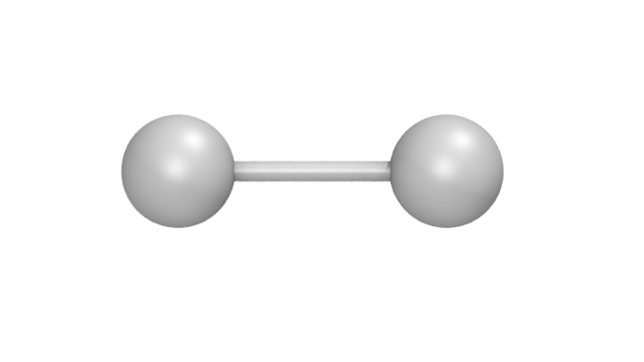
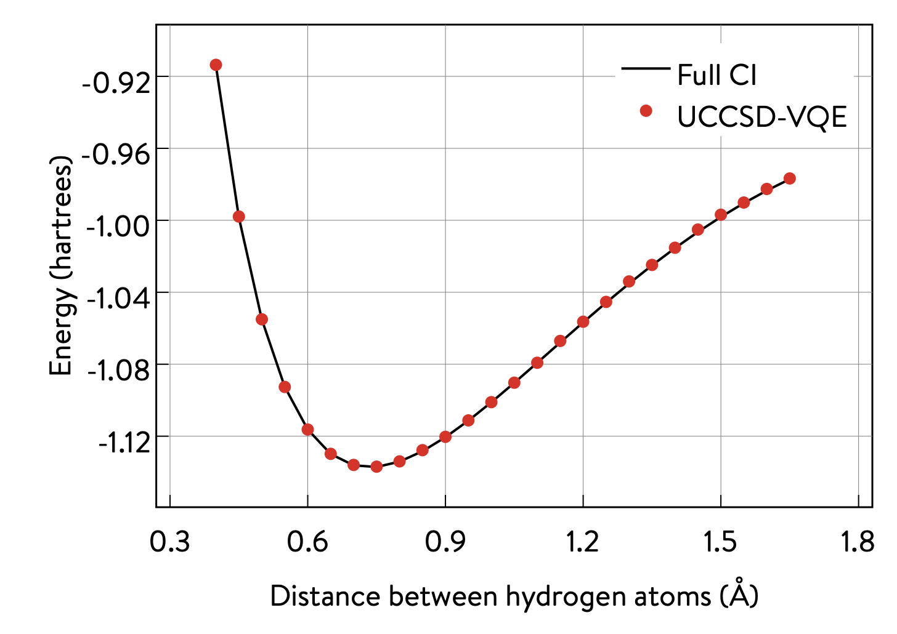

The Variational Quantum Eigensolver (VQE)
=========================================

1. A brief overview of the VQE algorithm
----------------------------------------

The Variational Quantum Eigensolver (VQE)
[`Peruzzo_et_al.,_2014 <https://arxiv.org/abs/1304.3061>`__,
`McClean_et_al.,_2015 <https://arxiv.org/abs/1509.04279>`__] has been
introduced as a hybrid quantum–classical algorithm for simulating
quantum systems. Some examples of quantum simulation using VQE include
solving the molecular electronic Schrödinger equation and model systems
in condensed matter physics (e.g., Fermi– and Bose–Hubbard models). In
this notebook, we focus on VQE within the context of solving the
molecular electronic structure problem for the ground-state energy of a
molecular system. The second-quantized Hamiltonian of such a system
assumes the following form:

.. raw:: latex

   \begin{equation}
   \hat{H} = h_{\text{nuc}} + \sum_{p,q} h^{p}_{q} \hat{a}^{\dagger}_p \hat{a}_q + \sum_{p,q,r,s} h^{pq}_{rs} \hat{a}^{\dagger}_p \hat{a}^{\dagger}_q \hat{a}_s \hat{a}_r\nonumber
   \end{equation}

Here, :math:`h_{\text{nuc}}` is a constant. The coefficients
:math:`h^{p}_{q}` and :math:`h^{pq}_{rs}` are obtained by solving the
mean-field problem. The Hamiltonian is then transformed into the qubit
basis (e.g., Jordan–Wigner, Bravyi–Kitaev). This means that it is
expressed entirely in terms of operators acting on qubits:

.. raw:: latex

   \begin{equation}
   \hat{H} = h_{\text{nuc}} + \sum_{\substack{p \\ \alpha}} h_{p}^{\alpha} \sigma_p^{\alpha} + \sum_{\substack{p,q \\ \alpha,\beta}} h_{pq}^{\alpha\beta}\sigma_p^{\alpha}\otimes\sigma_{q}^{\beta} + \sum_{\substack{p,q,r \\ \alpha,\beta,\gamma}}h_{pqr}^{\alpha\beta\gamma}\sigma_p^{\alpha}\otimes\sigma_{q}^{\beta}\otimes\sigma_r^{\gamma} + \ldots \nonumber
   \end{equation}

We now consider a trial wavefunction ansatz
:math:`\vert \Psi(\vec{\theta}) \rangle = U(\vec{\theta}) \vert 0 \rangle`
that depends on a set :math:`\{\theta_i\}_{i=1}^{m}` of :math:`m`
parameters that enter a unitary operator which acts on the reference
(i.e., mean-field) state :math:`\vert 0 \rangle`. The variational
principle dictates that we can minimize the expectation value of the
Hamiltonian,

.. raw:: latex

   \begin{equation}
   E = \min_{\vec{\theta}} \frac{\langle \Psi(\vec{\theta}) \vert \hat{H} \vert \Psi(\vec{\theta}) \rangle}{\langle \Psi(\vec{\theta}) \vert \Psi(\vec{\theta}) \rangle} \geq E_{\text{gs}}\nonumber
   \end{equation}

to determine the optimal set of variational parameters. The energy thus
computed will be an upper bound to the true ground-state energy
:math:`E_{\text{gs}}`. Once a suitable variational trial ansatz has been
chosen (e.g., a unitary coupled-cluster ansatz, a heuristic ansatz), we
must provide a suitable set of initial guess parameters. If our ansatz
is written in according to the second quantization picture, we must also
transform it into the qubit basis before proceeding. We must also apply
other approximations (e.g., Trotter–Suzuki) to render it amenable for
translation into a quantum circuit. The resulting qubit form of the
ansatz can then be translated into a quantum circuit and, thus, able to
be implemented on quantum hardware. Once the initial state has been
prepared using a quantum circuit, energy measurements are performed
using quantum hardware or an appropriate simulation tool. The energy
value obtained is the sum of the measurements of the expectation values
of each of the terms that contribute to the Hamiltonian (assuming the
wavefunction has been normalized to unity):

.. raw:: latex

   \begin{equation}
   E = \langle \Psi(\vec{\theta}) \vert \hat{H} \vert \Psi(\vec{\theta}) \rangle =\langle\hat{H}\rangle = h_{\text{nuc}} + \sum_{\substack{p \\ \alpha}} h_{p}^{\alpha} \langle\sigma_p^{\alpha}\rangle + \sum_{\substack{p,q \\ \alpha,\beta}} h_{pq}^{\alpha\beta}\langle\sigma_p^{\alpha}\otimes\sigma_{q}^{\beta}\rangle + \sum_{\substack{p,q,r \\ \alpha,\beta,\gamma}}h_{pqr}^{\alpha\beta\gamma}\langle\sigma_p^{\alpha}\otimes\sigma_{q}^{\beta}\otimes\sigma_r^{\gamma}\rangle + \ldots \nonumber
   \end{equation}

The computed energy is then input to a classical optimizer in order to
find a new set of variational parameters, which are then used to prepare
a new state (i.e., a quantum circuit) on the quantum hardware. The
process is repeated until convergence. The algorithm is illustrated
below.

.. image:: img/VQE_overview.png
    :align: center
    :width: 750

2. Computing the ground–state energy of H\ :math:`_{\text{2}}` with UCCSD-VQE
-----------------------------------------------------------------------------

The **Microsoft Quantum Development Kit (QDK)** provides a way to
simulate quantum circuits on classical hardware and quantum processors.
It uses the Microsoft Q# language, which was developed specifically to
handle hybrid quantum–classical workflows.

The **Microsoft quantum chemistry library** provides key functionalities
for tackling problems in quantum chemistry. It is written in C#, and
relies on Q# operations to implement various quantum algorithms. This is
an open source GitHub repository that accepts suggestions and
contributions: https://github.com/Microsoft/QuantumLibraries

Although users are able to write and call their own code in Q# and C#,
this is not a requirement. This notebook uses Python exclusively. All
the functionality needed to execute the example that follows can be
accessed through the **Microsoft Python interop**.

This section shows how these functionalities can be used to compute the
ground state energy of H\ :math:`_{\mathrm{2}}` (the simplest molecule)
in a minimal basis set, using the unitary coupled-cluster ansatz with
single and double excitations (UCCSD) and compare the results with the
exact results obtained in this basis. A ball-stick model for
H\ :math:`_\text{2}` is shown below. The distance between the two
hydrogen atoms is called the bond length, and its value is set to
approximately 0.7414\ :math:`~`\ Å in this section.

2.1 The Q# Python package
~~~~~~~~~~~~~~~~~~~~~~~~~

The cell below prepares the Q# environment and loads the useful
functionalities of the Chemistry library through ``qsharp.chemistry``.
This notebook later details how each of these play a role in this
implementation of VQE.

.. code:: ipython3

    import qsharp.chemistry

.. code:: ipython3

    from qsharp.chemistry import load_broombridge, load_fermion_hamiltonian, load_input_state, encode

2.2 Input data
~~~~~~~~~~~~~~

Users need to provide quantities defining the target molecular system,
such as the following:

-  one- and two-electron integrals
-  nuclear repulsion energy

The use of VQE requires to specify extra input, such as the following:

-  the type of ansatz desired (UCCSD, for example)
-  the values for initial variational parameters
-  an initial state (a reference wavefunction, such as the Hartree–Fock
   wavefunction)

The **Microsoft Broombridge** format provides a way to store all the
input information in a human-readable .yaml file. Loading a pre-existing
Broombridge file containing the information of interest for the target
molecular system is the shortest way to get started with running VQE.
The Python interop allows data structures defined in C# and Q# to be
serialized and exposed to the Python context as objects whose data
structure consists of nested dictionaries, lists, and tuples.

The following code snippet shows how to load existing data from a
Broombridge file (here for H\ :math:`_\text{2}` at a bond length of
0.7414), and explores the resulting data structure.

.. code:: ipython3

    # C# Chemistry library :: Loading molecular data (electronic integrals, etc.) from Broombridge                                                                                                    
    filename = 'data/hydrogen_0.2.yaml'                                                                                                                                                              
    broombridge_data =  load_broombridge(filename)

The data structure is easier to navigate when using a pretty-print
application or a proper IDE.

It is worth mentioning that users do not need a Broombridge file
describing the molecular system of interest in order to get started.
They could, for example, compute and provide their own data at runtime
using third-party libraries such as PySCF, and then be free to extract
and overwrite the information in the data structures produced by reading
any Broombridge file.

The instructions below show how users can read information stored in a
data structure (writing to the data structure is just as
straightforward).

.. code:: ipython3

    # Retrieve basis set and geometry used to generate the input data
    basis_set = broombridge_data.problem_description[0].basis_set
    geometry = broombridge_data.problem_description[0].geometry
    
    # Retrieve the nuclear repulsion and the one-electron integrals (Mulliken convention)
    nuclear_repulsion = broombridge_data.problem_description[0].coulomb_repulsion['Value']
    one_electron_integrals =  broombridge_data.problem_description[0].hamiltonian['OneElectronIntegrals']['Values']
    
    print("nuclear_repulsion = ", nuclear_repulsion)
    print("one_electron_integrals = ", one_electron_integrals)

.. parsed-literal::

    nuclear_repulsion =  0.713776188
    one_electron_integrals =  [([1, 1], -1.252477495), ([2, 2], -0.475934275)]

**NB**: Users directly writing to the data structures should be aware
that the Python interop relies on JSON serialization, and should use
fundamental data types. They should make sure to pass lists instead of
NumPy arrays, or to cast their integer and floating point values with
the built-in **int** and **float** Python functions to avoid JSON
serialization errors at runtime.

2.3 Qubit Hamiltonian, UCCSD ansatz, and initial variational parameters
~~~~~~~~~~~~~~~~~~~~~~~~~~~~~~~~~~~~~~~~~~~~~~~~~~~~~~~~~~~~~~~~~~~~~~~

The following section shows how to prepare the qubit Hamiltonian (also
referred to as the Pauli Hamiltonian) and access the information related
to one of the available ansatz for VQE: UCCSD.

**NB**: As the underlying data structures may change in the future, the
code cells below encourages users to print their content by directly
accessing the available fields, exposed by the ``dir`` built-in Python
function.

The fermionic Hamiltonian can be built using the chemistry library, and
is returned to the Python context:

.. code:: ipython3

    ferm_hamiltonian = broombridge_data.problem_description[0].load_fermion_hamiltonian()
    print("ferm_hamiltonian ::", ferm_hamiltonian)
    print(dir(ferm_hamiltonian))

.. parsed-literal::

    ferm_hamiltonian :: <qsharp.chemistry.FermionHamiltonian object at 0x7f2f3cb5df98>
    ['__class__', '__delattr__', '__dict__', '__dir__', '__doc__', '__eq__', '__format__', '__ge__', '__getattribute__', '__gt__', '__hash__', '__init__', '__init_subclass__', '__le__', '__lt__', '__module__', '__ne__', '__new__', '__reduce__', '__reduce_ex__', '__repr__', '__setattr__', '__sizeof__', '__str__', '__subclasshook__', '__weakref__', 'add_terms', 'system_indices', 'terms']

A Broombridge file can contain suggestions of initial states to use to
carry electronic computations of a molecule. In particular, they can be
used by the UCCSD ansatz to store information about the initial state
(i.e., the reference wavefunction) as well as initial values for the
variational parameters and the spin-orbital excitations to whic they
correspond.

Several initial states can be available and stored in a Broombridge file
as a result of classical computations from libraries such as NWChem, for
example. The user can specify which initial state to load with the
following code snippet:

.. code:: ipython3

    input_state = load_input_state(filename, "UCCSD |G>")
    print("input_state ::", input_state)
    print(dir(input_state))

.. parsed-literal::

    input_state :: <qsharp.chemistry.InputState object at 0x7f2f3cb5d7f0>
    ['Energy', 'MCFData', 'Method', 'SCFData', 'UCCData', '__class__', '__delattr__', '__dict__', '__dir__', '__doc__', '__eq__', '__format__', '__ge__', '__getattribute__', '__gt__', '__hash__', '__init__', '__init_subclass__', '__le__', '__lt__', '__module__', '__ne__', '__new__', '__reduce__', '__reduce_ex__', '__repr__', '__setattr__', '__sizeof__', '__str__', '__subclasshook__', '__weakref__']

Users can decide what excitations should be included in the ansatz and
how the values of variational parameters can be tied to specific
excitations, or enforce that a unique value should be tied to several
terms during the classical optimization later. The last entry in
``inputstate[Superposition]`` is the initial state, here showing a
Hartree-Fock state, with the two lower orbitals filled with one electron
each.

The chemistry library can now build the qubit Hamiltonian with a
transformation such as the Jordan–Wigner transformation.

.. code:: ipython3

    jw_hamiltonian = encode(ferm_hamiltonian, input_state)
    print("jw_hamiltonian :: \n", jw_hamiltonian)

.. parsed-literal::

    jw_hamiltonian :: 
     (4, ([([0], [0.17120128499999998]), ([1], [0.17120128499999998]), ([2], [-0.222796536]), ([3], [-0.222796536])], [([0, 1], [0.1686232915]), ([0, 2], [0.12054614575]), ([0, 3], [0.16586802525]), ([1, 2], [0.16586802525]), ([1, 3], [0.12054614575]), ([2, 3], [0.1743495025])], [], [([0, 1, 2, 3], [0.0, -0.0453218795, 0.0, 0.0453218795])]), (3, [((0.001, 0.0), [2, 0]), ((-0.001, 0.0), [3, 1]), ((-0.001, 0.0), [2, 3, 1, 0]), ((1.0, 0.0), [0, 1])]), -0.09883444600000002)

**NB** : Currently, the underlying ``JordanWignerEncodingData`` data
structure from the chemistry library is also used to store the initial
state for UCCSD as well as the variational parameters representing the
one- and two-body amplitudes (specified as the third entry of the
resulting ``jw_hamiltonian`` tuple object). In the future, the objects
may be kept separate and thus the ``inputState`` field may not be
required to compute the qubit Hamiltonian. Users can, however, retrieve
the values of the variational parameters directly from the data
structure, with a function such as the following:

.. code:: ipython3

    def get_var_params(jw_hamiltonian):
        """ Retrieve the values of variational parameters from the jw_hamiltonian object """
        _, _, input_state, _ = jw_hamiltonian
        _, var_params = input_state
        params = [param for ((param, _), _) in var_params]
        return params[:-1]
    
    var_params = get_var_params(jw_hamiltonian)
    print(var_params)

.. parsed-literal::

    [0.001, -0.001, -0.001]

2.4 Energy evaluation using the Q# quantum algorithms
~~~~~~~~~~~~~~~~~~~~~~~~~~~~~~~~~~~~~~~~~~~~~~~~~~~~~

The Python interop can now be used in a similar fashion to call quantum
algorithms written in Q#. These can be user defined or come from one of
the available Q# libraries.

The energy is computed as an expectation value
:math:`E(\theta) = \langle \Psi(\vec{\theta}) \vert \hat{H} \vert \Psi(\vec{\theta}) \rangle =\langle\hat{H}\rangle`,
which can be estimated by drawing many samples of the underlying
distribution (e.g., running the quantum circuit and measuring for each
sample). This approach is the one used on quantum hardware, and relies
on sampling to approach the expectation value, using the ``simulate``
function. The accuracy of the expectation value, and therefore the
result of the energy evaluation, directly correlates with the number of
samples used. The fast frequency estimator provided in the QDK allows
for the approximation of the result for a very large number of samples
without incurring longer runtimes.

.. code:: ipython3

    qsharp.reload()
    from VQE import energy_evaluation
    
    energy, _ = energy_evaluation.simulate(jw_hamiltonian=jw_hamiltonian, n_samples=1e18)
    energy += jw_hamiltonian[3]
    
    print("Energy evaluated at {0} : {1} \n".format(var_params, energy))

2.5 Classical optimization
~~~~~~~~~~~~~~~~~~~~~~~~~~

VQE is a quantum–classic hybrid algorithm that aims to compute
:math:`E = \min_{\vec{\theta}} \: \langle \Psi(\vec{\theta}) \vert \hat{H} \vert \Psi(\vec{\theta}) \rangle`.
This approach relies on solving an optimization problem, using a
classical optimizer to tune the values of the variational parameters
:math:`\{\theta_i\}_{i=1}^{m}`.

There are several Python libraries that provide implementations of
optimizers based on different heuristics, and SciPy is one that is
widely used. The optimizers in ``scipy.optimize`` have a common
interface that require users to provide the following:

-  A handle to a Python function to perform energy evaluations. It takes
   the variational parameters as its first input, leaving other
   parameters that are to be left out of the optimization process
   afterwards.
-  Values for the initial parameters
-  Optional parameters used by our energy evaluation function, that
   should not be optimized
-  Optional parameters defining the behaviour and termination criteria
   for the chosen optimizer

The first item requires the user to provide a Python wrapper (here named
``energy_eval_wrapper``) with the expected signature, in order to call
the ``energy_evaluation`` operation available in the Microsoft chemistry
library. This wrapper requires the variational parameters to be passed
as a list or a NumPy array and, currently, an extra step is needed to
modify the data structure passed to the Q# context in order to use the
correct values (defined in ``set_var_params`` below).

.. code:: ipython3

    def set_var_params(var_params, jw_hamiltonian):
        """ Set variational parameters stored in the JW data-structure to the desired values"""
        # Unpack data structure
        a1, a2, input_state, a3 = jw_hamiltonian
        b1, amps = input_state
        # Unpack and overwrite variational parameters
        new_amps = [((var_params[i], 0.0), amps[i][1]) for i in range(len(var_params))]
        new_amps.append(amps[-1])
        # Re-pack the data structure
        input_state = (b1, new_amps)
        jw_hamiltonian = (a1, a2, input_state, a3)
        return jw_hamiltonian

.. code:: ipython3

    def energy_eval_wrapper(var_params, jw_hamiltonian, n_samples):
        """
            A wrapper whose signature is compatible with the use of scipy optimizers,
            calling the Q# energy_evalaution from the Microsoft Chemistry library
        """
        
        # NumPy arrays are currently not supported by the Python interops
        # This ensures that neither the user nor SciPy call the energy evaluation function with a NumPy array
        var_params = list(var_params)
    
        # Set the varational parameters to the right values in the jw_hamiltonian object
        jw_hamiltonian = set_var_params(var_params, jw_hamiltonian)
        
        # Calculate energy:
        energy, _ = energy_evaluation.simulate(jw_hamiltonian=jw_hamiltonian, n_samples=n_samples)
        energy += jw_hamiltonian[3]
    
        print("Energy evaluated at {0} : {1} \n".format(var_params, energy))
        return energy

These two functions can then be used to run VQE. For simplicity, a
specific optimizer from the SciPy library is used, with given
hyperparameters such as tolerance or step size. Since accuracy of energy
evaluation is correlated to the number of samples drawn, it is important
to set it to a number large enough to guarantee that it is consistent
with the optimizers convergence criteria, and to ensure the correct
approximation of derivatives used by some optimizers. Setting a very
large number of samples would solve this issue.

.. code:: ipython3

    from scipy.optimize import minimize
    
    def VQE(initial_var_params, jw_hamiltonian, n_samples):
        """ Run VQE Optimization to find the optimal energy and the associated variational parameters """
        
        opt_result = minimize(energy_eval_wrapper,
                              initial_var_params,
                              args=(jw_hamiltonian, n_samples),
                              method="COBYLA",
                              tol=0.000001,
                              options={'disp': True, 'maxiter': 200,'rhobeg' : 0.05})
        
        return opt_result

.. code:: ipython3

    # Run VQE and print the results of the optimization process
    opt_result = VQE(var_params, jw_hamiltonian, 1e18)
    print(opt_result)

.. code:: ipython3

    # Print difference with exact FCI value known for this bond length
    fci_value = -1.1372704220924401
    print("Difference with exact FCI value :: ", abs(opt_result.fun - fci_value))

.. parsed-literal::

    Difference with exact FCI value ::  8.066117551663865e-09

3 Potential energy surface of H\ :math:`_\text{2}` with VQE, using the 1QBit OpenQEMIST package
-----------------------------------------------------------------------------------------------

The potential energy surface of this molecule can be obtained by
plotting the energy of the system as a function of the distance between
the hydrogen atoms.

This section shows how the 1QBit OpenQEMIST package allows users to run
VQE without relying on an input Broombridge file, or worrying about
modifying the data structures returned by the Python interop in the
previous section. Users can directly provide the geometry and basis set
of the target molecular system: OpenQEMIST computes the mean field and
electronic integrals using PySCF, generates the UCCSD one- and two-body
excitations, and provides good initial variational parameters using MP2
amplitudes.

OpenQEMIST provides several electronic structure solvers, such as VQE,
FCI, and CCSD. This package can be used to compute the
H\ :math:`_\text{2}` bond dissociation curve using VQE, with Microsoft
libraries, and compare it to the exact FCI values, computed on-the-fly.
Running the code cells in this section should yield a plot that closely
resembles the one below:

.. code:: ipython3

    # Import the OpenQEMIST package from 1QBit and PySCF
    import openqemist
    import pyscf
    import numpy as np

.. code:: ipython3

    from pyscf import gto, scf
    from openqemist.electronic_structure_solvers import VQESolver, FCISolver
    from openqemist.quantum_solvers.parametric_quantum_solver import ParametricQuantumSolver
    from openqemist.quantum_solvers import MicrosoftQSharpParametricSolver
    
    # Iterate over different bond lengths
    bond_lengths = np.arange(0.4, 1.7, 0.1)
    energies_FCI, energies_VQE = [], []
    
    for bond_length in bond_lengths:
    
        # Create molecule object with PySCF
        H2 = [['H',[ 0, 0, 0]], ['H',[0,0, bond_length]]]
        mol = gto.Mole()
        mol.atom = H2
        mol.basis = "sto-3g"
        mol.charge = 0
        mol.spin = 0
        mol.build()
    
        # Compute FCI energy with PySCF, for reference
        solver = FCISolver()
        energy = solver.simulate(mol)
        energies_FCI += [energy]
        
        # Compute energy with VQE, instantiating a VQESolver object using the UCCSD ansatz
        solver = VQESolver()
        solver.hardware_backend_type = MicrosoftQSharpParametricSolver
        solver.ansatz_type = MicrosoftQSharpParametricSolver.Ansatze.UCCSD
        energy = solver.simulate(mol)
        energies_VQE += [energy]
